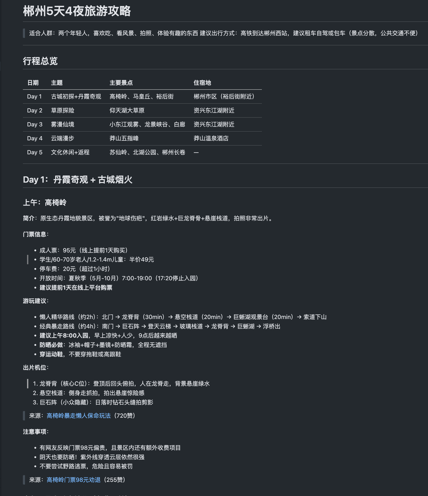
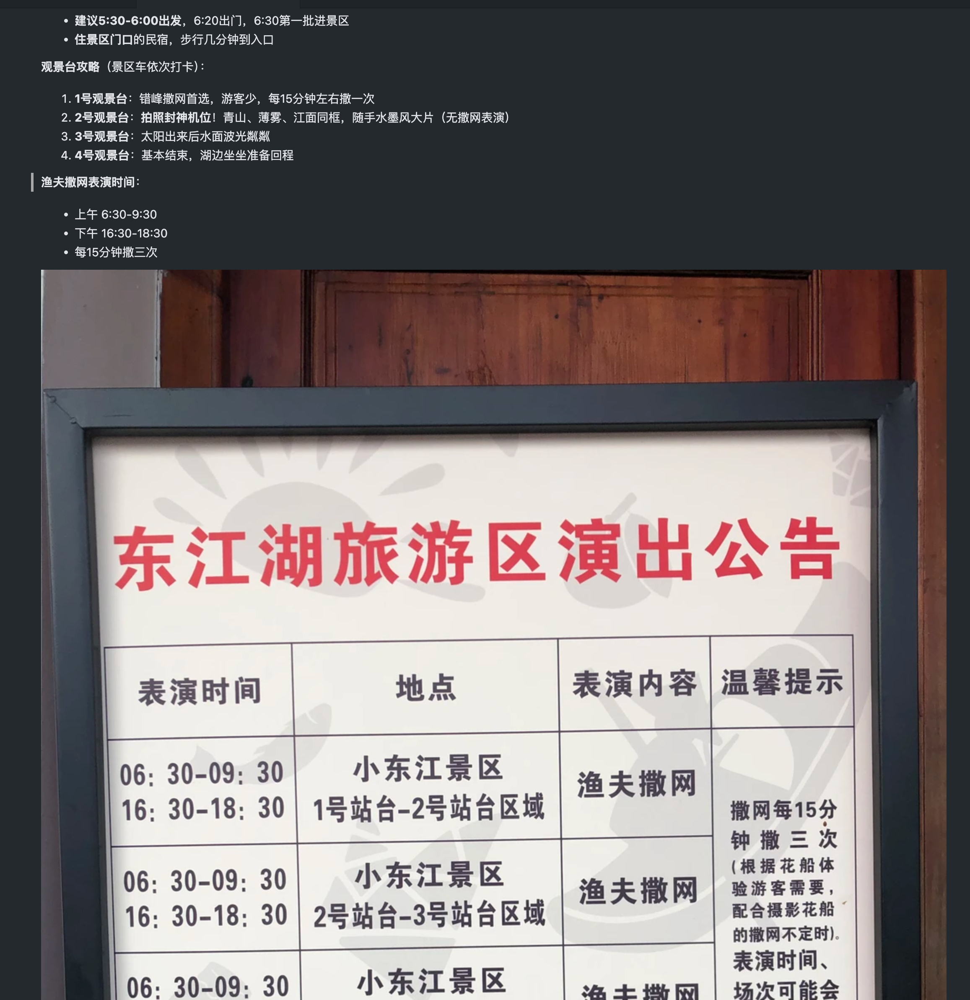
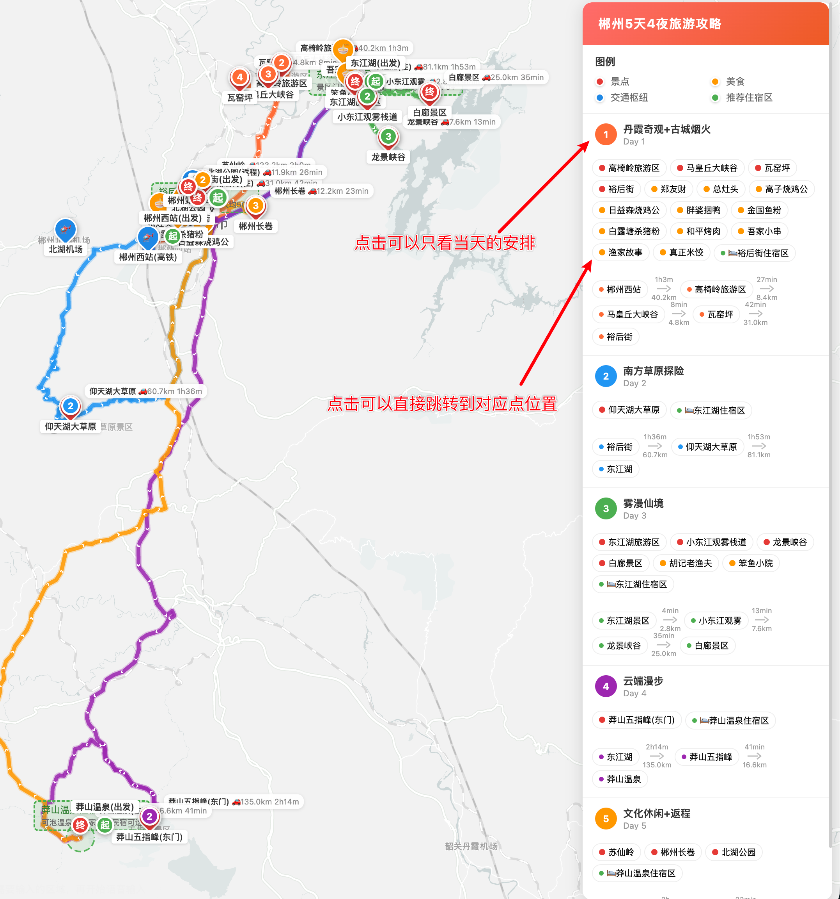
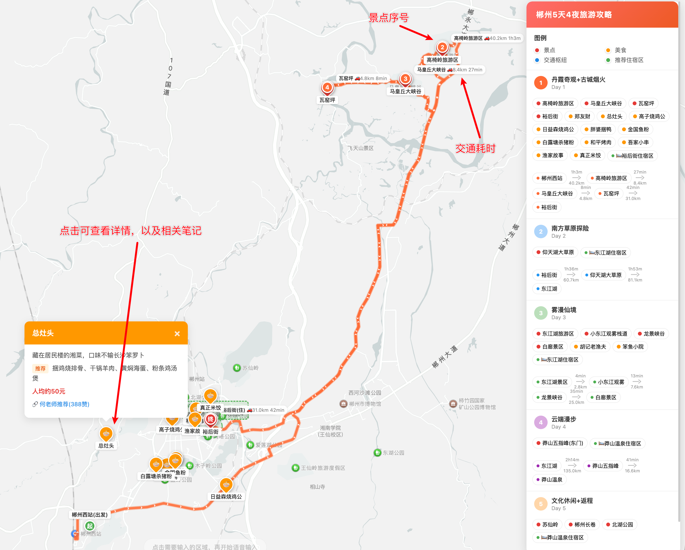
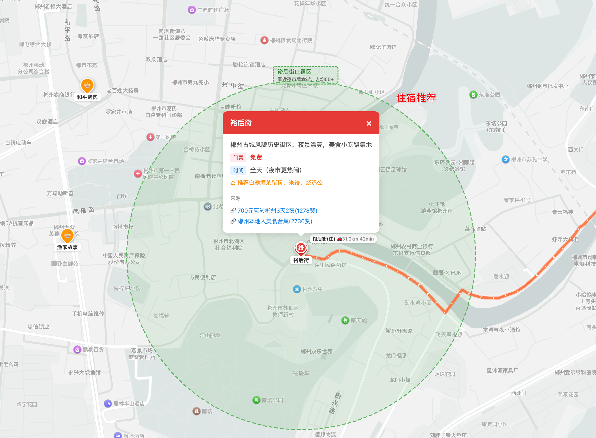

# 使用方法
- clone该项目，claude code打开该项目，最好开启免审批模式
- 给浏览器安装OpenCLI的插件，具体查看[OpenCLI仓库](https://github.com/jackwener/OpenCLI)说明
- 浏览器登录小红书，并保持浏览器打开
- 申请高德地图开发者api-key（不会的话可以直接claude code问如何申请），申请后
    - .env_demo文件重命名为.env，并把web service key填入其中(高德地图接口使用，比如搜索位置，计算路线)
    - config_demo.js文件重命名为config.js，并把js api key填入其中（地图绘制使用）
- 跟claude code说：`我想去XXX旅游，（补充旅游需求），请根据 @旅游攻略需求.md 帮我制作一份攻略`
- 等待完成即可

# 效果展示
## 攻略截图

## 地图截图

